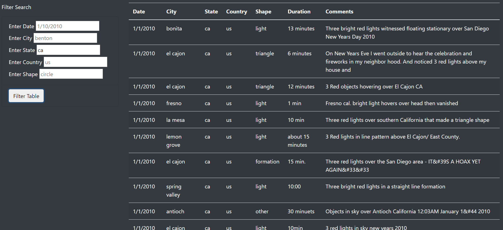

# UFO Sightings with Javascript

## Overview of Project

- This project provides a more in-depth analysis of UFO sightings by allowing users to filter for multiple criteria at the same time. In addition to the date, you’ll add table filters for the city, state, country, and shape.

## Results

- Before filtering, every UFO sighting is listed in the table.
- 
- After entering the date of sighting, only sightings that match that date will stay in the table; every other sighting is filtered out.
- 
- After entering the city of sighting, only sightings that match that city name will stay in the table. In this particular case, thee is only one sighting in this given city on this date, thus further filtering will not be needed. 
- 
- You can also filter by state; this is the list of every sighting in California.
- 
- You can also filter by shape; this is the list of every sighting where the UFO was shaped like a circle.
- 

## Summary

- The one drawback of this design is that this filtering system does not include duration.
- We could fix that by adding a new filter called "duration," in the form of "from blank to blank." Users can enter things like "from 1min to 5min" or "from 30sec to 60sec."
- We could add a predictive text on key up method, where if users type "be" in the city column, the system will reveal a drop down menu where city names that begin with "be" will show up, such as "Benton."
